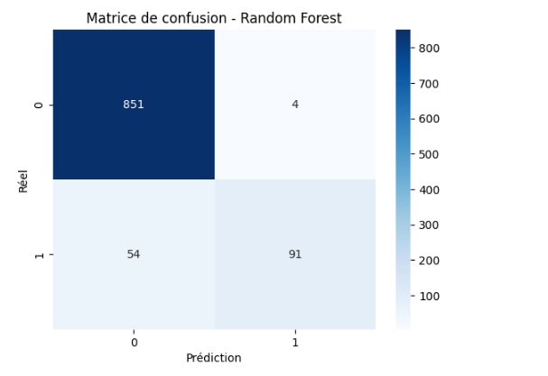
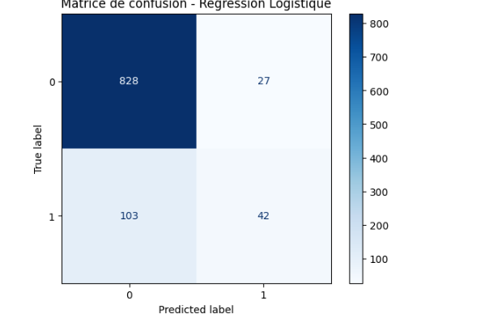
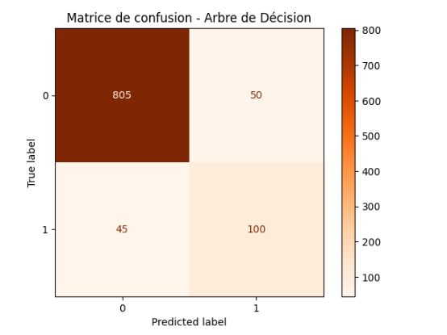

# Prédiction du Churn des Clients Télécom


## Aperçu du projet
Ce projet vise à prédire si un client d’une compagnie télécom va résilier son abonnement (churn) ou non, à partir de ses données d’utilisation : durée des appels, nombre de messages vocaux, appels internationaux, appels au service client, etc.

## Courte description
À partir du dataset bigml_59.csv, nous allons construire plusieurs modèles de classification (régression logistique, arbre de décision, random forest) afin de comparer leurs performances.  
L’objectif final est de fournir aux décideurs des *recommandations concrètes pour réduire le churn*, améliorer la fidélisation et augmenter la rentabilité.


## Compréhension du problème

### Contexte métier
Les entreprises de télécommunication font face à un défi majeur : *la perte de clients (churn)*.  
Conserver un client existant coûte souvent beaucoup moins cher que d’en acquérir un nouveau.  
Dans ce contexte, anticiper quels clients risquent de résilier leur contrat permet à l’entreprise de mettre en place des stratégies de *fidélisation ciblées* (offres promotionnelles, services personnalisés, meilleure assistance, etc.).


### Parties prenantes
- *Direction Marketing* : souhaite comprendre les profils de clients à risque afin de mettre en place des campagnes ciblées.  
- *Service Client* : veut savoir quels clients sont plus susceptibles d’appeler pour se plaindre avant de résilier.  
- *Direction Générale* : s’intéresse aux pertes financières liées au churn et aux stratégies pour améliorer la rétention.  

### Objectif du projet
Construire un modèle de *classification prédictive* capable de prédire si un client va *résilier son contrat (churn = True)* ou *rester (churn = False)*.  

Le modèle permettra :  
1. D’identifier les *facteurs clés* qui influencent la résiliation.  
2. De détecter les clients à risque avant qu’ils ne partent.  
3. De proposer des *recommandations stratégiques* pour améliorer la satisfaction et la fidélité client.  

### Problème métier
- Question clé : « Pouvons-nous prédire la résiliation d’un client télécom à partir de ses données d’utilisation et d’interaction avec l’entreprise ? »  
- Valeur ajoutée : une meilleure fidélisation entraîne une *augmentation directe des revenus* et une réduction des coûts liés à l’acquisition de nouveaux clients.

## Compréhension des données

### Source des données
Le dataset utilisé est bigml_59.csv, un ensemble de données classiques sur le *Customer Churn dans le secteur des télécommunications*.  
Il contient des informations détaillées sur l’utilisation du service par les clients, leurs interactions avec l’entreprise et leur statut de fidélité (churn ou non).

### Description du dataset
- *Nombre d’observations* : 3 333 clients  
- *Nombre de variables* : 21  
- *Variable cible* :  
  - churn : indique si le client a résilié son contrat (True) ou non (False).

### Variables explicatives principales
- *Caractéristiques clients*
  - state : État du client  
  - account length : Durée de l’abonnement (en jours)  
  - area code : Code régional du client  
  - phone number : Numéro de téléphone (identifiant, pas utile pour la modélisation)

- *Plans d’abonnement*
  - international plan : Oui / Non → indique si le client a souscrit un plan international  
  - voice mail plan : Oui / Non → indique si le client a souscrit un plan messagerie vocale  
  - number vmail messages : Nombre de messages vocaux stockés  

- *Utilisation des services*
  - total day minutes, total day calls, total day charge  
  - total eve minutes, total eve calls, total eve charge  
  - total night minutes, total night calls, total night charge  
  - total intl minutes, total intl calls, total intl charge  

- *Service client*
  - customer service calls : Nombre d’appels passés au service client  

### Observations initiales
- Le dataset mélange des variables *numériques* (minutes, appels, charges) et *catégorielles* (plans, état, churn).  
- La variable phone number est uniquement un identifiant → elle sera supprimée dans la préparation des données.  
- Certaines variables comme area code ou state pourraient avoir un effet limité sur le churn.  
- La variable churn est déséquilibrée (moins de clients churn que non churn), ce qui devra être pris en compte dans la modélisation.  

### Objectif de l’exploration
- Comprendre la répartition de la variable cible (churn).  
- Identifier les corrélations entre les comportements (utilisation des minutes, appels au service client, plans) et le churn.  
- Préparer les données pour l’entraînement des modèles de classification.

## Modèle de prédiction du churn

L’objectif principal est de créer un *modèle de machine learning capable de prédire si un client va résilier son contrat (churn)*, en se basant sur ses caractéristiques et son comportement d’utilisation des services.  

### Approche proposée

1. *Sélection des features*  
   Utiliser les variables pertinentes liées aux plans, à l’usage du service et au service client.  

2. *Prétraitement*  
   - Suppression des colonnes non pertinentes (phone number)  
   - Encodage des variables catégorielles (international plan, voice mail plan, state)  
   - Standardisation des variables numériques pour homogénéiser les échelles  

3. *Division du dataset*  
   Séparer les données en *train set (70%)* et *test set (30%)* en utilisant la stratification pour conserver la proportion de churn.  

4. *Choix des modèles*  
   - Modèle simple et interprétable : *régression logistique* ou *arbre de décision*  
   - Modèle optimisé avec réglage des hyperparamètres : *Random Forest, **XGBoost* ou *Logistic Regression avec régularisation*  

5. *Évaluation*  
   - Mesures de classification adaptées à un problème déséquilibré : *accuracy, **precision, **recall, **F1-score, **ROC-AUC*  
   - Comparer les performances sur les données d’entraînement et de test pour détecter surapprentissage ou sous-apprentissage  

### Objectif final

- Identifier les clients à risque de churn pour permettre à l’entreprise de *mettre en place des actions préventives*, comme des promotions ciblées ou un meilleur suivi du service client.  
- Fournir un modèle *interprétable et robuste* pour soutenir les décisions stratégiques.

## Préparation des données

La préparation des données est une étape cruciale pour garantir la qualité et la performance des modèles de classification.  
Les étapes appliquées sur le dataset bigml_59.csv sont les suivantes :

### 1. Chargement du dataset
- Importer les données avec pandas.  
- Vérifier les dimensions et un aperçu des premières lignes.  

### 2. Nettoyage des données
- Vérifier la présence de *valeurs manquantes* et les traiter si nécessaire.  
- Supprimer les colonnes non pertinentes comme phone number.  

### 3. Transformation des variables catégorielles
- Encodage des variables binaires (international plan, voice mail plan, churn) en valeurs numériques (0/1).  
- Encodage des variables nominales (state, area code) avec *One-Hot Encoding* si elles sont jugées utiles.

### 4. Mise à l’échelle des variables numériques
- Normalisation ou standardisation des variables continues (total day minutes, total eve minutes, etc.) afin d’uniformiser les échelles.  

### 5. Séparation des données
- Division en *ensemble d’entraînement (train)* et *ensemble de test* avec train_test_split (par exemple 70%/30%).  
- La variable cible est churn.  

### 6. Gestion du déséquilibre de classes
- Vérification de la répartition entre clients churn et non churn.  
- Éventuellement appliquer un rééquilibrage (technique *SMOTE* ou pondération des classes) pour améliorer la performance des modèles.

```python
import pandas as pd
import numpy as np
from sklearn.model_selection import train_test_split
from sklearn.preprocessing import StandardScaler, LabelEncoder
from sklearn.linear_model import LogisticRegression
from sklearn.tree import DecisionTreeClassifier
from sklearn.ensemble import RandomForestClassifier
from sklearn.metrics import accuracy_score, precision_score, recall_score, f1_score, roc_auc_score, confusion_matrix, classification_report
import matplotlib.pyplot as plt
import seaborn as sns
```

### Standardisation

```python
# Standardisation des colonnes numériques
numeric_cols = X_train.select_dtypes(include=np.number).columns
scaler = StandardScaler()
X_train[numeric_cols] = scaler.fit_transform(X_train[numeric_cols])
X_test[numeric_cols] = scaler.transform(X_test[numeric_cols])
print("Données standardisées")
```
### Régression logistique

```python
# Sélection des features et de la cible
X = df.drop(columns=["churn"], errors="ignore")  # supprime 'churn', ignore si absent
y = df["churn"].astype(int)                       # encode True/False en 1/0

# Encodage des colonnes catégorielles
X = pd.get_dummies(X, drop_first=True)

# Division train/test
X_train, X_test, y_train, y_test = train_test_split(
    X, y, test_size=0.3, random_state=42, stratify=y
)

# Standardisation
scaler = StandardScaler()
X_train = scaler.fit_transform(X_train)
X_test = scaler.transform(X_test)

# Entraînement Logistic Regression
logreg = LogisticRegression(max_iter=1000, random_state=42)
logreg.fit(X_train, y_train)

# Prédictions et évaluation
y_pred_train = logreg.predict(X_train)
y_pred_test = logreg.predict(X_test)

print("Train Accuracy:", accuracy_score(y_train, y_pred_train))
print("Test Accuracy:", accuracy_score(y_test, y_pred_test))
print("Classification report:\n", classification_report(y_test, y_pred_test))
```

### Matrice de confusion

```python
cm = confusion_matrix(y_test, y_pred_test_rf)
sns.heatmap(cm, annot=True, fmt='d', cmap='Blues')
plt.xlabel("Prédiction")
plt.ylabel("Réel")
plt.title("Matrice de confusion - Random Forest")
plt.show()
```

<p style='text-align: center; font-style: italic; color: #7f8c8d;'>
</p>
### Standardisation et Modèles

```python
# Standardisation
scaler = StandardScaler()
X_train_scaled = scaler.fit_transform(X_train)
X_test_scaled = scaler.transform(X_test)

# Modèle 1 : Régression Logistique
logreg = LogisticRegression(max_iter=1000, random_state=42)
logreg.fit(X_train_scaled, y_train)
y_pred_logreg = logreg.predict(X_test_scaled)

# Modèle 2 : Arbre de Décision
dt = DecisionTreeClassifier(random_state=42)
dt.fit(X_train_scaled, y_train)
y_pred_dt = dt.predict(X_test_scaled)

# Matrices de confusion
from sklearn.metrics import ConfusionMatrixDisplay

# Logistic Regression
cm_logreg = confusion_matrix(y_test, y_pred_logreg)
disp_logreg = ConfusionMatrixDisplay(cm_logreg, display_labels=[0,1])
disp_logreg.plot(cmap=plt.cm.Blues)
plt.title("Matrice de confusion - Régression Logistique")
plt.show()

# Decision Tree
cm_dt = confusion_matrix(y_test, y_pred_dt)
disp_dt = ConfusionMatrixDisplay(cm_dt, display_labels=[0,1])
disp_dt.plot(cmap=plt.cm.Oranges)
plt.title("Matrice de confusion - Arbre de Décision")
plt.show()

# Évaluation
print("Accuracy Logistic Regression:", accuracy_score(y_test, y_pred_logreg))
print("Classification report Logistic Regression:\n", classification_report(y_test, y_pred_logreg))
print("Accuracy Decision Tree:", accuracy_score(y_test, y_pred_dt))
print("Classification report Decision Tree:\n", classification_report(y_test, y_pred_dt))
```

<p style='text-align: center; font-style: italic; color: #7f8c8d;'>
</p>



<p style='text-align: center; font-style: italic; color: #7f8c8d;'>
</p>

#### Importance des features

```python
# Supposons que X soit votre DataFrame initial (avant split)
X_orig = X.copy()  # garder les noms de colonnes

# Standardisation
from sklearn.preprocessing import StandardScaler
scaler = StandardScaler()
X_train_scaled = scaler.fit_transform(X_train)
X_test_scaled = scaler.transform(X_test)

# Recréer un DataFrame avec les colonnes
X_train_df = pd.DataFrame(X_train_scaled, columns=X_orig.columns)
X_test_df = pd.DataFrame(X_test_scaled, columns=X_orig.columns)

# Calcul des importances avec Random Forest
importances = pd.Series(rf.feature_importances_, index=X_train_df.columns).sort_values(ascending=False)

import matplotlib.pyplot as plt
import seaborn as sns

plt.figure(figsize=(10,6))
sns.barplot(x=importances[:10], y=importances.index[:10])
plt.title("Top 10 features importantes")
plt.show()
```


